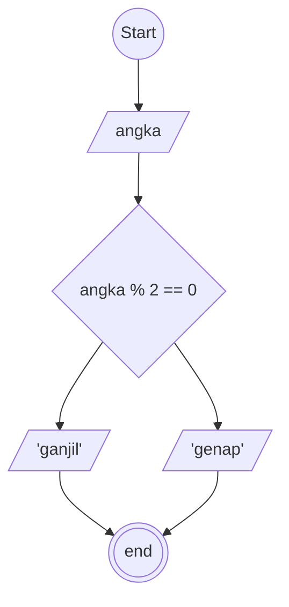

# Algoritma type penulisan : Deskriptif

## Case: Membuat algoritma menentukan bilangan ganjil atau genap

1. mulai
2. membuat penampung dengan nama Angka
3. menentukan bilangan genap dengan membagi penampung(Angka) modulus 2 kalo habis brarti itu bilangan genap kalo sisa brarti itu bilangan ganjil
4. masukan ke penampung hasil
5. selesai

### Flowchart



### PSeudo-Code

```pseudo

DECLARE angka: INTEGER

INPUT angka

IF angka % 2 == 0 THEN
    OUTPUT "genap"
ELSE
    OUTPUT "ganjil"
ENDIF

```
