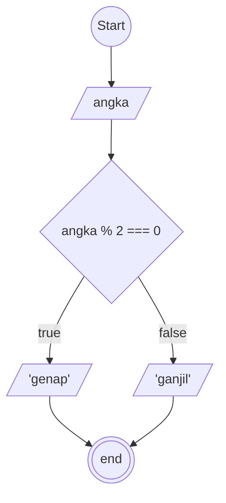

# Algoritma type penulisan : Deskriptif

## Case: Membuat algoritma menentukan bilangan ganjil atau genap

1. mulai
2. membuat penampung dengan nama hasil
3. membuat penampung dengan nama Angka
4. menentukan bilangan genap adalah dengan membagi penampung(Angka) dengan 2 kalo habis brarti itu bilangan genap
5. menentukan bilangan ganjil adalah dengan membagi penampung(Angka) dengan 2 kalo sisa brarti itu bilangan ganjil
6. masukan ke penampung hasil
7. selesai

### Flowchart

