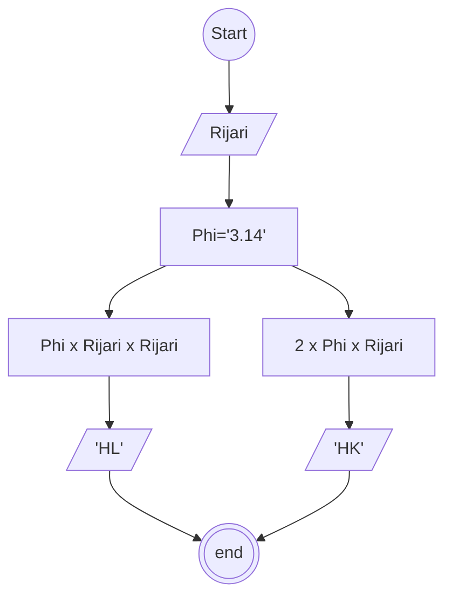

# Algoritma type penulisan : Deskriptif

## Case: membuat algoritma menghitung luas dan keliling lingkaran

phi: 3.14 atau 22/7
R : jari jari

rumus:
Luas = Phi x r x r
Keliling = 2 x phi x r

1. mulai
2. membuat penampung jari jari (Rijari) dengan type data decimal
3. membuat penampung Phi (TT) dengan type data decimal
4. mengitung luas dengan TT x Rijari x Rijari
5. membuat penampung hasil luas (HL)
6. memasukan hasil menghitung luas ke dalam s
7. mengitung keliling dengan 2 x TT x Rijari
8. membuat penampung hasil keliling (HK)
9. memanggil HL dan HK untuk menampilkan hasil
10. selesai

