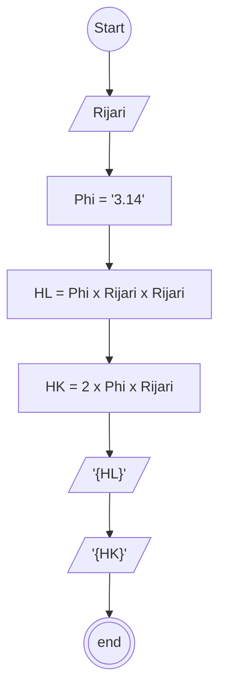

# Algoritma type penulisan : Deskriptif

## Case: membuat algoritma menghitung luas dan keliling lingkaran

phi: 3.14 atau 22/7
R : jari jari

rumus:
Luas = Phi x r x r
Keliling = 2 x phi x r

1. mulai
2. membuat penampung jari jari (Rijari) dengan type data decimal
3. membuat penampung Phi (TT) dengan type data decimal
4. membuat penampung hasil luas (HL)
5. membuat penampung hasil keliling (HK)
6. isi penampung HL adalah TT x Rijari x Rijari
7. isi penampung HK adalah 2 x TT x Rijari
8. memanggil HL dan HK untuk menampilkan hasil
9. selesai



## PSeudo-code

```pseudo

DECLARE Rijari : DOUBLE
CONSTANTS Phi : DOUBLE
DECLARE HL : DOUBLE
DECLARE HR : DOUBLE

HL <- Phi x Rijari x Rijari
HR <- 2 x Phi x Rijari

OUTPUT HL
OUTPUT HR


```
