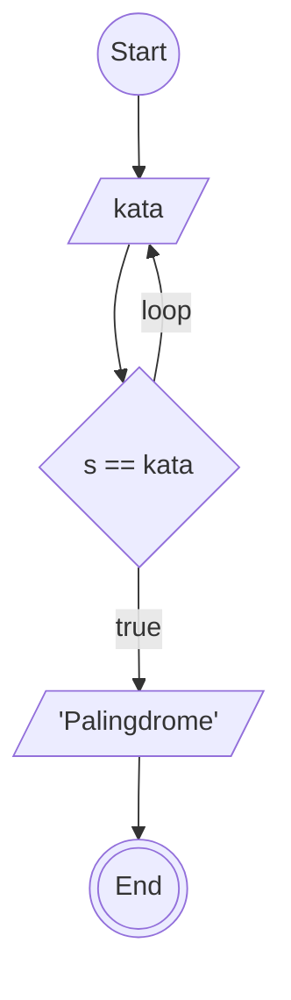

# ALGORITMA

## DESKRIPTIF case: mengecek kata palingdrome

1. start
2. buat penampung (Kata)
3. eja kata tiap huruf dari akhir ke awal masukan di penampung (s)
4. kalo s sama dengan kata brarti palingdrome
5. kalo tidak sama brati tidak palingdrome
6. end

## Flowchart case: mengecek kata palingdrome



## PSeudo-Code case: mengecek kata palingdrome

```memaid
pseudo

DECLARE kata : STRING
DECLARE s : INTEGER

INPUT kata

FOR s <- 0 TO kata
IF kata(s) == kata THEN
    OUTPUT "Palingdrome"
ELSE
    OUTPUT "Bukan Palingdrome"
ENDIF

```
