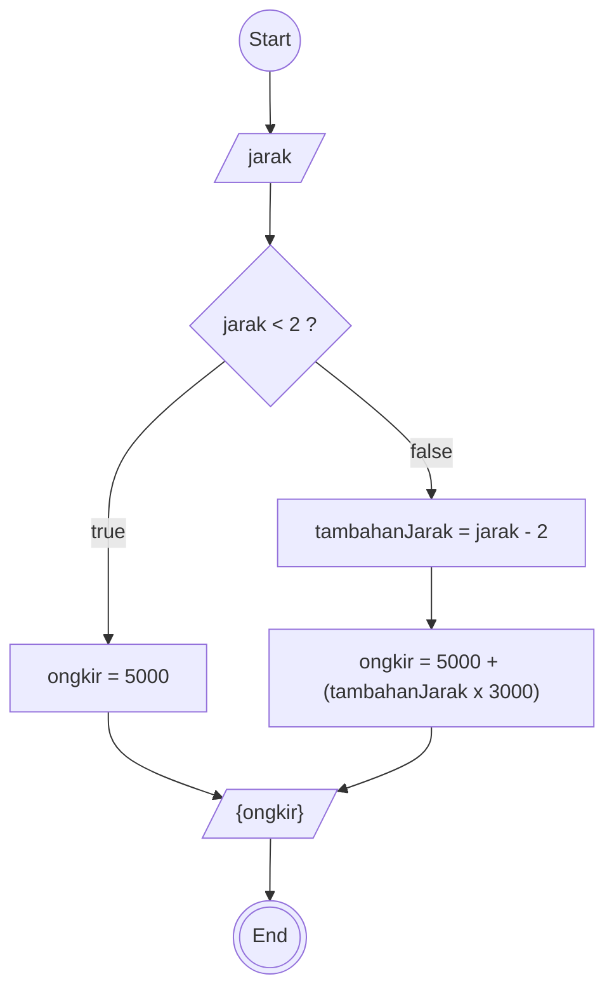

# ALGORITMA

## DESKRIPTIF case: menghitung ongkir

1. start
2. bikin penampung (jarak)
3. bikin penampung (ongkir)
4. Jika jarak kurang dari 2 km brati ongkir = 5000
5. Jika jarak lebih dari 2 km penampung(tambahanJarak) < kurangin 2 Hitung ongkir = 5000 + (tambahanJarak × 3000)
6. Tampilkan ongkir
7. jika jarak lebih kecil dari 2 output 5000
8. end

## Flowchart case: menghitung ongkir



## PSeudo-Code case: menghitung ongkir

```pseudo

DECLARE jarak : INTEGER
DECLARE ongkir : INTEGER
DECLARE tambahanJarak : INTEGER

INPUT jarak

IF jarak < 2 THEN
   ongkir ← 5000
ELSE
   tambahanJarak ← jarak - 2
   ongkir ← 5000 + (tambahanJarak * 3000)
ENDIF

OUTPUT ongkir

```
