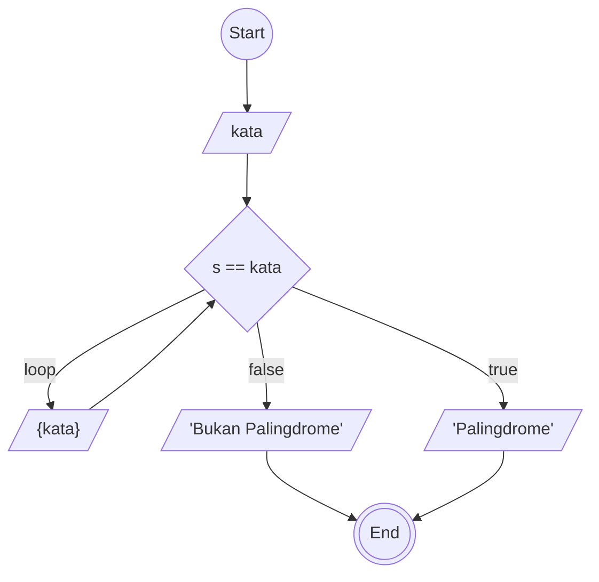

# ALGORITMA

## DESKRIPTIF case: mengecek kata palidrome

1. start
2. buat penampung (Kata)
3. eja kata tiap huruf dari akhir ke awal masukan di penampung (s)
4. kalo s sama dengan kata brarti palidrome
5. kalo tidak sama brati tidak palingdrome
6. end

## Flowchart case: mengecek kata palindrome



## PSeudo-Code case: mengecek kata palindrome

```memaid
pseudo

DECLARE kata : STRING
DECLARE s : INTEGER

INPUT kata

FOR s <- 10 TO 1
    kata <- s
NEXT s
IF s == kata THEN
    OUTPUT "Palindrome"
ELSE
    OUTPUT "Bukan Palindrome"
ENDIF

```
